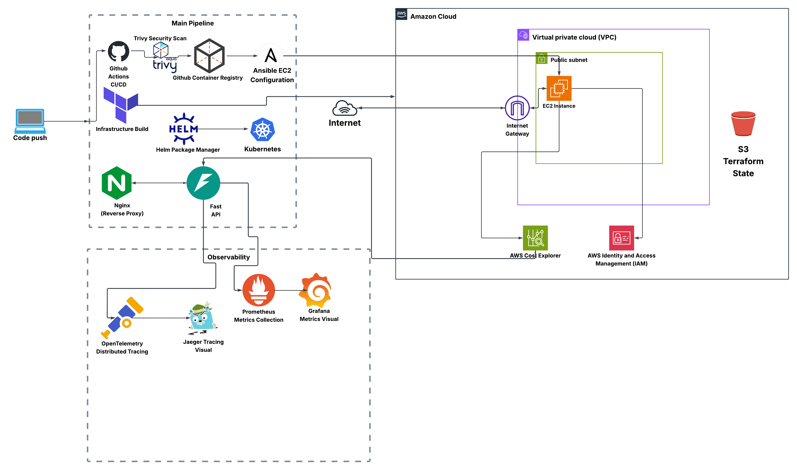

# AWS Cost Tracker 💰

> Real-time AWS infrastructure cost monitoring platform built with production-grade DevOps practices.

[](https://github.com/MoeDini95/aws-cost-tracker/actions/workflows/ci.yml)


---

## Overview

AWS Cost Tracker is a full-stack cloud-native application that monitors and visualizes AWS infrastructure spending in real time. Built as a portfolio project to demonstrate end-to-end DevOps engineering — from API development to cloud deployment, observability, and security.

---
## Architecture




---

## Tech Stack

| Layer | Technology |
|---|---|
| Language | Python 3.14+ |
| API Framework | FastAPI + Uvicorn |
| AWS SDK | boto3 |
| Reverse Proxy | Nginx |
| Containerization | Docker + Docker Compose |
| Orchestration | Kubernetes (KIND locally) |
| K8s Package Manager | Helm |
| IaC | Terraform |
| Configuration Management | Ansible |
| CI/CD | GitHub Actions |
| Security Scanning | Trivy (two-stage) |
| Metrics | Prometheus + prometheus-fastapi-instrumentator |
| Dashboards | Grafana |
| Distributed Tracing | OpenTelemetry + Jaeger |
| Testing | pytest + moto (AWS mocking) |
| Code Quality | Pylint (10/10) |

---

## API Endpoints

| Endpoint | Method | Description |
|---|---|---|
| `/health` | GET | Health check with timestamp |
| `/version` | GET | Current app version |
| `/costs/summary` | GET | Total AWS spend for current month |
| `/costs/breakdown` | GET | Cost breakdown by AWS service |
| `/costs/history` | GET | Daily cost trend for current month |
| `/metrics` | GET | Prometheus metrics |

---

## Features

- **Real-time cost monitoring** — queries AWS Cost Explorer API via boto3
- **Service breakdown** — see exactly which AWS service is costing what
- **Daily trends** — track spending day by day to catch anomalies
- **Custom metrics** — tracks Cost Explorer API call counts per endpoint
- **Distributed tracing** — OpenTelemetry traces every request end-to-end
- **Two-stage security scanning** — Trivy scans base image and final image in CI
- **Full observability** — metrics (Prometheus), logs (Docker), traces (Jaeger)
- **Zero-downtime deployments** — Kubernetes rolling updates
- **One-command rollback** — `helm rollback` or `kubectl rollout undo`

---

## Prerequisites

- Python 3.12+
- Docker Desktop
- AWS CLI configured (`aws configure`)
- Terraform >= 1.5
- Ansible
- kubectl + KIND
- Helm

---

## Quick Start (Local)

### 1. Clone the repository
```bash
git clone https://github.com/MoeDini95/aws-cost-tracker.git
cd aws-cost-tracker
```

### 2. Set up Python environment
```bash
python3 -m venv .venv
source .venv/bin/activate
pip install -r requirements.txt
```

### 3. Run locally with uvicorn
```bash
uvicorn app.main:app --reload
```

Visit `http://localhost:8000/docs`

### 4. Run full stack with Docker Compose
```bash
docker compose up --build
```

| Service | URL |
|---|---|
| API (via Nginx) | http://localhost |
| API (direct) | http://localhost:8000 |
| Prometheus | http://localhost:9090 |
| Grafana | http://localhost:3000 |
| Jaeger | http://localhost:16686 |

---

## Running Tests

```bash
pytest tests/ -v
```

All tests use mocked AWS calls — no real AWS credentials needed for testing.

```
tests/test_main.py::test_health PASSED
tests/test_main.py::test_version PASSED
tests/test_main.py::test_costs_summary PASSED
tests/test_main.py::test_costs_breakdown PASSED
tests/test_main.py::test_costs_history PASSED
5 passed in 0.28s
```

---

## CI/CD Pipeline

Every push to `main` triggers the GitHub Actions pipeline:

```
1. Checkout code
2. Set up Python 3.12
3. Install dependencies
4. Pylint code quality check (10/10)
5. pytest unit tests (5/5 passing)
6. Login to GitHub Container Registry
7. Trivy base image scan (warning only)
8. Build and push Docker image to GHCR
9. Trivy final image scan (reporting mode)
```

Docker image: `ghcr.io/moedini95/aws-cost-tracker:latest`

---

## Kubernetes Deployment

### Local (KIND)

```bash
# Set up cluster
./scripts/setup-cluster.sh

# Deploy with Helm
helm install aws-cost-tracker infrastructure/helm/

# Upgrade
helm upgrade aws-cost-tracker infrastructure/helm/ --set image.tag=v1.0.0

# Rollback
helm rollback aws-cost-tracker 1

# Port forward to test
kubectl port-forward service/aws-cost-tracker 8080:80
```

---

## Cloud Deployment (AWS)

### Provision infrastructure with Terraform
```bash
./scripts/tf-deploy.sh
```

Creates: VPC, public subnet, internet gateway, EC2 t3.micro, security group, IAM role

### Configure EC2 with Ansible
```bash
cd ansible
ansible-playbook playbook.yml
```

Installs Docker, copies app files, pulls image from GHCR, starts full stack.

### Manage EC2 instance
```bash
./scripts/ec2-start.sh   # start instance and get new IP
./scripts/ec2-stop.sh    # stop instance to save costs
```

---

## Monitoring

### Grafana Dashboard
Open `http://localhost:3000` (admin/admin)

Dashboard: **AWS Cost Tracker - API Monitoring**

| Panel | Metric |
|---|---|
| API Request Count | `http_requests_total` |
| Average Response Time | `http_request_duration_seconds_sum` |
| Error Rate | `rate(http_requests_total[5m])` |
| Cost Explorer API Calls | `cost_explorer_api_calls_total` |

### Jaeger Traces
Open `http://localhost:16686` → select `aws-cost-tracker` → Find Traces

Each `/costs/summary` request shows ~550ms trace — almost entirely AWS Cost Explorer response time.

---


## Version History

| Version | Phase | What |
|---|---|---|
| v0.1.0 | Phase 2 | FastAPI backend with Cost Explorer |
| v0.2.0 | Phase 3 | Docker + Nginx |
| v0.3.0 | Phase 4 | GitHub Actions CI/CD |
| v0.4.0 | Phase 5 | Kubernetes |
| v0.4.1 | Phase 5.5 | Helm + setup scripts |
| v0.5.0 | Phase 6 | Prometheus + Grafana |
| v0.5.1 | Phase 6.5 | Trivy + OpenTelemetry |
| v0.6.0 | Phase 7 | Terraform AWS infrastructure |
| v0.6.1 | Phase 7.5 | Ansible EC2 configuration |
| v1.0.0 | Phase 8 | Production ready |

---

## Author

**Mohamed Dine**
- GitHub: [@MoeDini95](https://github.com/MoeDini95)
- LinkedIn: [linkedin.com/in/mdine95](https://www.linkedin.com/in/mdine95/)

